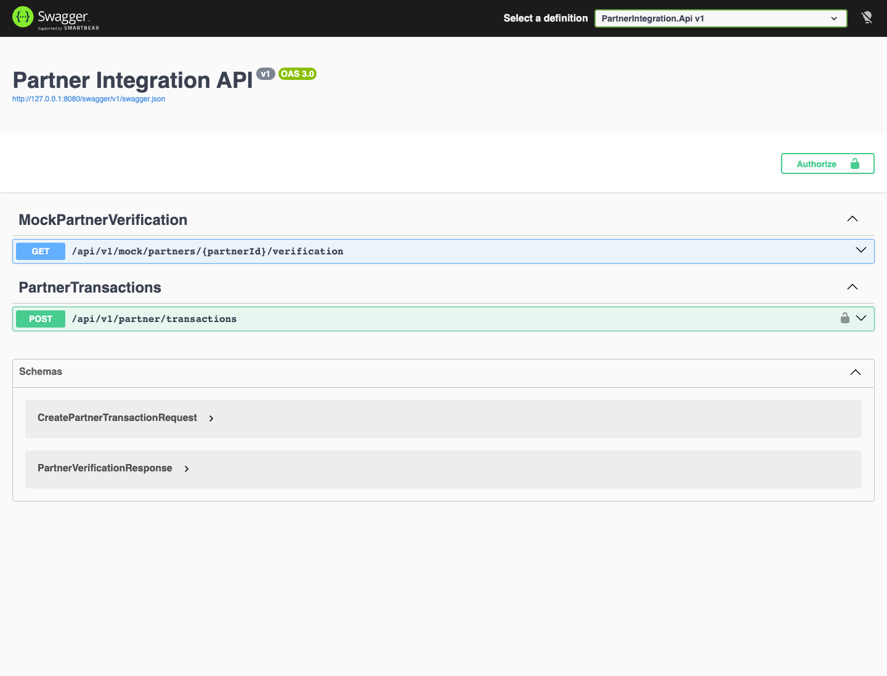
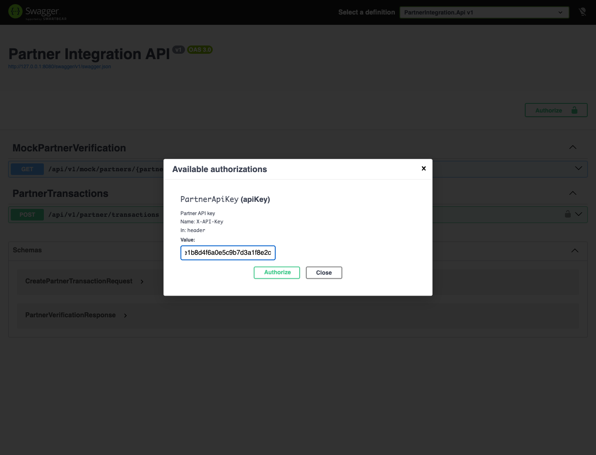
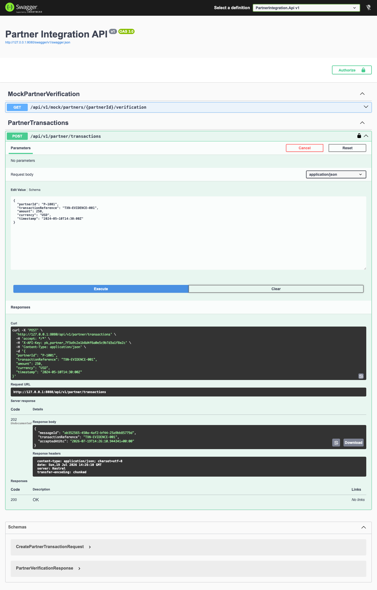
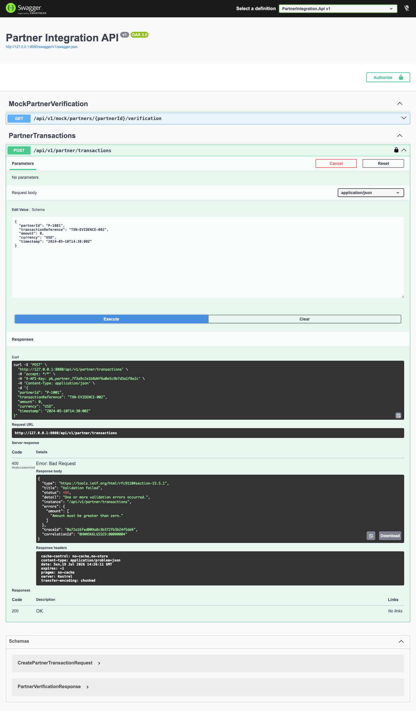
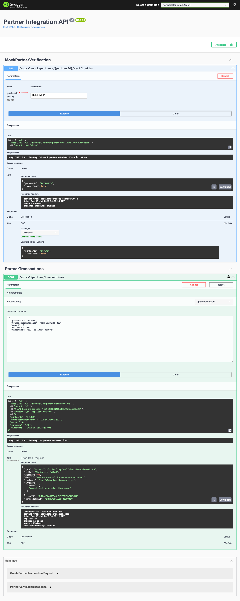
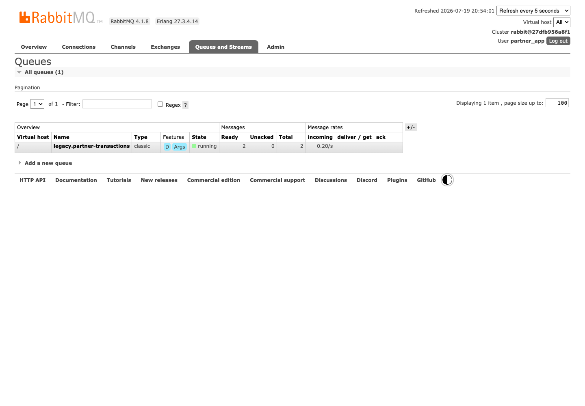
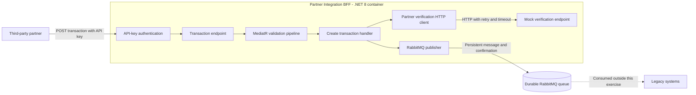
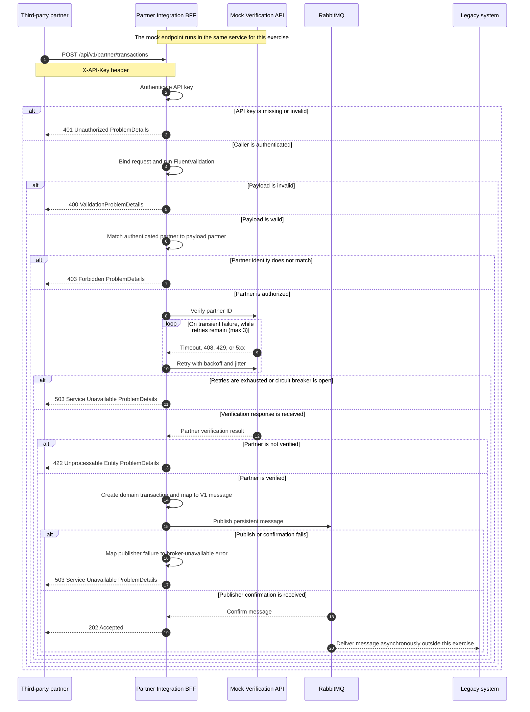

# Partner Integration BFF

As part of the platform's transition to an asset-light, partner-driven model, this .NET 8 Backend-for-Frontend (BFF) microservice receives transaction data from third-party partners, validates it, verifies the partner through an external API, and reliably queues accepted transactions for legacy systems to process.

## Demo

### Overview



### API key auth



### Create transaction (202)



### Invalid amount (400)



### Unverified partner



### Message in RabbitMQ



## Scenario implementation

| Scenario requirement | Implementation |
|---|---|
| Receive transactions from third-party partners | `POST /api/v1/partner/transactions` with API-key authentication |
| Validate incoming data | FluentValidation runs through the MediatR pipeline; domain value objects enforce the same invariants as a last line of defense |
| Enrich the acceptance decision through an external API | A typed HTTP client obtains the partner-verification result without leaking the external response model into the application layer |
| Handle transient verification failures | Timeouts, HTTP `408`, `429`, and `5xx` responses are retried with exponential backoff and jitter |
| Queue accepted transactions reliably | Persistent messages are published to a durable RabbitMQ queue with publisher confirmations |
| Support legacy processing | The queue provides the asynchronous boundary consumed by legacy systems; the consumer is outside this exercise |

### System overview



### Request flow



## Quick start

Prerequisite: Docker with Docker Compose.

```bash
cp .env.example .env
# Replace every placeholder secret in .env before starting the stack.
docker compose up --build
```

| Service | URL |
|---|---|
| API | `http://localhost:8080` |
| Swagger | `http://localhost:8080/swagger` |
| Health | `http://localhost:8080/health` |
| RabbitMQ Management | `http://localhost:15672` (credentials from `.env`) |

Follow the structured API logs with:

```bash
docker compose logs --follow api
```

```bash
# Stop and keep data
docker compose down

# Stop and reset all local data
docker compose down --volumes
```

## Run tests

```bash
# Full suite (unit + integration) — preferred
docker compose --profile test run --build --rm tests

# Unit tests only (local .NET 8 SDK)
dotnet test tests/PartnerIntegration.UnitTests/PartnerIntegration.UnitTests.csproj
```

Test reports from the Docker test profile are written to:

```text
TestResults/
├── unit.html
├── integration.html
├── unit.trx
└── integration.trx
```

Open the HTML reports in a browser for a readable test history. The TRX files remain available for CI tooling. Test names follow `Method_WhenCondition_ShouldExpectedResult`.

- **Unit tests** cover domain invariants, FluentValidation, handler orchestration, and HTTP resilience/retry.
- **Integration tests** cover authentication, status codes, and publisher interaction through stubs for verification and messaging (no live RabbitMQ in the test profile).
- **`docker compose up`** runs the API against a real RabbitMQ broker for local end-to-end publishing.

## API

```http
POST /api/v1/partner/transactions
Content-Type: application/json
X-API-Key: <partner secret>

{
  "partnerId": "P-1001",
  "transactionReference": "TXN-99823",
  "amount": 250.00,
  "currency": "USD",
  "timestamp": "2024-05-10T14:30:00Z"
}
```

All fields are required. `amount` must be greater than zero, and `currency` must be one of the configured currency codes.

| Status | Meaning |
|---|---|
| `202` | Transaction verified and queued |
| `400` | Invalid payload |
| `401` | Missing or invalid API key |
| `403` | API key does not belong to the payload partner |
| `422` | Partner is not verified |
| `503` | Verification API or RabbitMQ is unavailable |

Errors use RFC 7807 `ProblemDetails` and include both trace and correlation IDs.

The mock verification endpoint is `GET /api/v1/mock/partners/{partnerId}/verification`. By default it throws a timeout on 30% of calls and treats `P-INVALID` as unverified.

## Architecture

```text
src/
├── PartnerIntegration.Api
├── PartnerIntegration.Application
├── PartnerIntegration.Domain
└── PartnerIntegration.Infrastructure

tests/
├── PartnerIntegration.UnitTests
└── PartnerIntegration.IntegrationTests
```

## Resilience and messaging

The typed verification client uses `Microsoft.Extensions.Http.Resilience` with:

- Per-attempt timeout: 2 seconds.
- Total timeout: 10 seconds.
- Up to 3 retries with exponential backoff and jitter.
- Retry only for network failures, timeouts, HTTP `408`, `429`, and `5xx`.

RabbitMQ uses one durable queue named `legacy.partner-transactions`. Messages are persistent and published with confirmations through `ITransactionMessagePublisher`.

## Security and assumptions

- API keys and RabbitMQ credentials are supplied as environment variables. Docker Compose reads the ignored `.env` file for substitution into the containers; the app itself does not load `.env`.
- The API key identifies the partner; the payload cannot impersonate another partner.
- Supported currencies are configured in `appsettings.json` and default to `USD`, `EUR`, `GBP`, and `VND`.
- The mock endpoint stays in the same API because the exercise explicitly requests it in the same solution/project.
- Production systems should replace API keys with OAuth 2.0 or mTLS and add persistent idempotency if duplicate submissions must be prevented.
